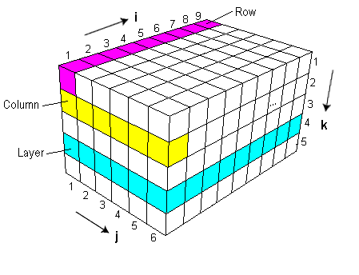
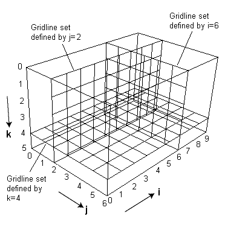

Cell Indexing
=============

MvMf6 use the same i-j-k indexing system as used by Modflow 6.

- :ref:`The i-j-k Index System for Cells <the_i_j_k_index_system_for_cells>`
- :ref:`The i-j-k Index System for Gridlines <the_i_j_k_index_system_for_gridlines>`

.. _the_i_j_k_index_system_for_cells:

""""""""""""""""""""""""""""""""
The i-j-k Index System for Cells
""""""""""""""""""""""""""""""""

- For a Modflow 6 model with structured discretization (DIS grid)

  * The index i runs along a row.
  * The index j runs along a column.
  * The index k increases from one layer to the next, counting from top to bottom.

.. _the_i_j_k_index_system_for_gridlines:

""""""""""""""""""""""""""""""""""""
The i-j-k Index System for Gridlines
""""""""""""""""""""""""""""""""""""

For a model with Structured Discretization (DIS grid) MvMf6 can display 3 gridline sets defined respectively by the indices i, j, and k. These **gridline sets** are illustrated below.

