Data Visualization
==================

MvMf6 can display the following: 

- :ref:`Scalar data <scalar_data>` such as hydraulic head or solute concentration.
- :ref:`Vector data <vector_data>` such as specific discharge or fluid velocity.
- Cells or nodes that represent :ref:`model features <model_features>` such as rivers and wells.
- :ref:`Auxiliary graphic objects <auxiliary_graphic_objects>` such as grid lines and bounding box to provide spatial reference and orientation.
- A :ref:`line drawing (overlay) <overlay>` on top of the grid or above the grid.

.. _scalar_data:

"""""""""""
Scalar Data
"""""""""""

- MvMf6 displays scalar data (for example, hydraulic head) by mapping scalar values to a :ref:`color bar <color_bar>`.

- Scalar data may be displayed as:

  * :ref:`a solid <solid>`
  * :ref:`a set of isosurfaces <isosurface>`

- The interior details of the scalar data may be explored by:

  * :ref:`cropping <cropping>`
  * :ref:`thresholding <thresholding>`

**To show scalar data as a solid**

- Click the **Show** menu and select **Solid**.

**To show scalar data as isosurfaces**

- Click the **Show** menu and select **Isosurfaces**.

**To hide the scalar data**

- Click the **Show** menu and select **None**.

**To specify or change the type of scalar data to display**

#. If the **Data** toolbox is not visible, display it by clicking the **Toolbox** menu and selecting **Data**.
#. Click the **Scalar** tab.
#. From the drop-list box, select the type of scalar data to display.

.. _color_bar:

"""""""""
Color Bar
"""""""""

- MvMf6 uses a red-to-blue color bar to represent a range of scalar values. (:ref:`How to customize the color bar <color_bar_toolbox>`)
- Either red or blue may represent the upper limit of the scalar range.
- Other colors can be selected as the end members of the color bar.
- The color bar may be linear or logarithmic.

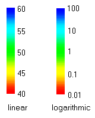

- Values outside the scalar range are clamped to the corresponding endpoint color. (For example, if red represents the lower limit of 40 and blue represents the upper limit of 60, then all values below 40 are displayed as red, and all values above 60 are displayed as blue.) 
- For a logarithmic color bar, both endpoints of the scalar range must be positive. 
- To alternately show or hide the color bar, click the **Show** menu and select **Color Bar**.

.. _solid:

"""""
Solid
"""""

- When scalar data are represented as a solid, all active cells in the grid are colored by mapping scalar values to the color bar. 
- Inactive cells, if present in the grid, are excluded. 
- Because the solid is rendered as opaque, only the exterior surface is visible. 
- The interior of the solid can be examined by :ref:`thresholding <thresholding>` and :ref:`cropping <cropping>`.

.. _coloring_schemes:

MvMf6 provides 3 **coloring schemes**: (:ref:`How to specify the coloring scheme <solid_toolbox>`)

.. _blocky:

- **Blocky**: Each cell has a uniform color according to the nodal value for that cell. This scheme is available only for finite-difference models (such as MODFLOW) but not for finite-element models.

.. _smooth:

- **Smooth**: Nodal values are interpolated to yield scalar values that vary smoothly from one node to another. Consequently, the colors vary smoothly through the solid. 

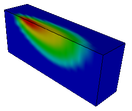

.. _banded:

- **Banded**: The solid is divided by isosurfaces into a discrete number of bands. Each band has a uniform color. 

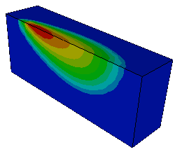

.. _isosurface:

""""""""""
Isosurface
""""""""""

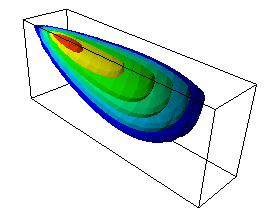

- An isosurface is a surface of constant scalar value.
- Each isosurface is colored according to the color bar.
- Isosurfaces may be examined by :ref:`cropping <cropping>`.

:ref:`How to create isosurfaces <isosurface_toolbox>`

.. _thresholding:

""""""""""""
Thresholding
""""""""""""

- Thresholding is a method to explore a :ref:`solid <solid>` by removing those portions where the scalar values lie outside a threshold range. (:ref:`How to threshold <solid_toolbox>`)

- If the coloring scheme is :ref:`blocky <blocky>`, thresholding will result in exclusion of all cells whose nodal values lie outside the threshold range.

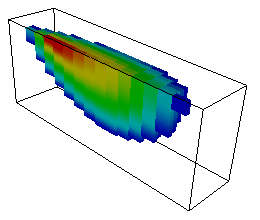

- If the coloring scheme is :ref:`smooth <smooth>`, thresholding will result in “carving” away portions of the solid along smooth, interpolated surfaces.

- Similarly, if the coloring scheme is :ref:`banded <banded>`, thresholding will also result in “carving” away portions of the solid along smooth, interpolated surfaces.

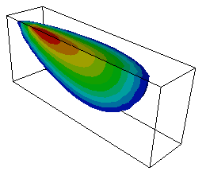

.. _cropping:

""""""""
Cropping
""""""""

- Cropping is a method for exploring a :ref:`solid <solid>` or a set of :ref:`isosurfaces <isosurface>` by showing only that portion that lies on one side of a cropping plane. (:ref:`How to crop <crop_toolbox>`)
- MvMf6 implements three pairs of cropping planes, denoted as the x, y, and z.
- By default, the pair of x cropping planes is perpendicular to the x axis, and similarly for the y and z cropping planes.
- However, the x and y cropping planes may also be rotated.
- When cropping is enabled, only the portion between a pair of cropping planes is displayed.
- The locations of the pair of x cropping planes, in their unrotated state, are specified as x = value1 (Min position) and x = value2 (Max position), where value1 is less than or equal to value2. The locations of the pair of y and z cropping planes are specified similarily.

.. note::
    - The x, y, and z axes are normalized to range from 0 to 1.

The figure below illustrates cropping a solid using the pair of y cropping planes at y = 0.3 (Min position) and y = 0.7 (Max position). 

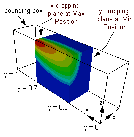

The figure below illustrates cropping a set of isosurfaces using the pair of y cropping planes at y = 0.3 (Min position) and y = 0.7 (Min position).

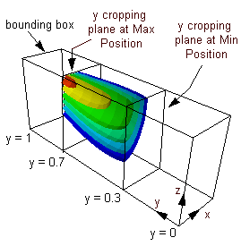

.. _vector_data:

"""""""""""
Vector Data
"""""""""""

**To show or hide vector data**

- Click the **Show** menu and select **Vector**. This alternately shows or hides the vectors. 

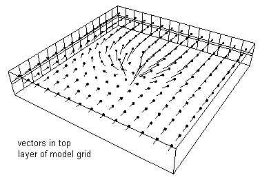

- MvMf6 displays a vector as a line oriented in the direction of the vector. The length of the line is proportional to the vector magnitude or, if choosen by the user, the logarithm of the ratio of the vector magnitude to the smallest vector magnitude. (:ref:`How to control vector display <vector_toolbox>`)
- The starting point of the vector is the center of a cell. A small cube (called the **base**) may be displayed at the starting point.

.. note::
    - Showing all vectors in the grid may result in a very cluttered picture.

- For models with structured discretization (DIS grid) , vectors can be displayed for a selected range of i, j, and k indices of the grid or cropped i the same way as scalar data may be cropped. In addition, the vector data may be "subsampled" by showing every n-th vector (n > 1) along the i, j, and k directions.
- Thresholding may be applied to display only those vectors having magnitudes within a specified range.

.. _model_features:

""""""""""""""
Model Features
""""""""""""""

**To show or hide model features**

- Click the **Show** menu and select **Model Features**. This alternately shows or hides the model features.

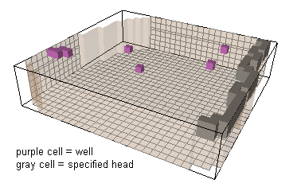

- MvMf6 can display cells that represent model features such as streams, wells, or boundary conditions.
- Each type of model feature is indicated by a different color. (:ref:`How to control model feature display <model_features_toolbox>`)

.. _auxiliary_graphic_objects:

"""""""""""""""""""""""""
Auxiliary Graphic Objects
"""""""""""""""""""""""""

MvMf6 can display the following auxiliary graphic objects to provide spatial reference and orientation: 

- **Grid Shell**: A semi-transparent shell representing the outer surface of the volume composed of all active cells. (:ref:`How to set the color and opacity of the grid shell <grid_toolbox>`)
- **Grid Lines**: For models with structured discretization (DIS grid), three :ref:`gridline sets <the_i_j_k_index_system_for_gridlines>` defined respectively by the index i, j, or, k. (:ref:`How to control the gridline sets <grid_toolbox>`)
- **Axes Symbol**: Three-mutually perpendicular lines or tubes, colored red, green, and blue, respectively indicating the orientation of the x, y, and z axes. (:ref:`How to set the size and position of the axes symbol <geometry_toolbox>`)
- **Bounding Box**: The smallest box that contains all active cells. The edges of the bounding box are aligned with the x-y-z axis system.

To alternately show or hide the above items, click the **Show** menu and select the item.

.. _overlay:

"""""""
Overlay
"""""""

- MvMf6 can import a line drawing to be displayed as an "overlay" on the top surface of a grid or above the grid. (:ref:`How to import an overlay <overlay_toolbox>`)
- The line drawing must be contained in either an ESRI Shapefile or a DXF file. However, not all entities in a DXF file are supported. The following DXF entities are displayed: line, polyline, circle, arc, and text.
- As illustrated below, the overlay may be "draped" on the top surface of the grid (left figure), or displayed as a flat drawing above the grid (right figure).

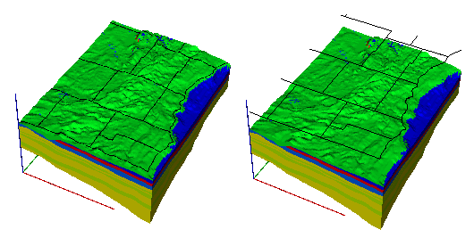

**To show or hide the overlay (after it has been imported)**

- Click the **Show** menu and select **Overlay**. This alternately shows or hides the overlay.

"""""""""""""""
Simulation Time
"""""""""""""""

To alternately show or hide the simulation time, click the **Show** menu and select **Time**.

- The simulation time is displayed near the lower left corner of the :ref:`display area <display_area>`
- The time unit is that assumed in the model. 
