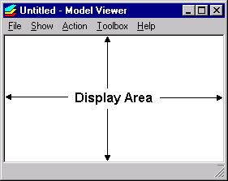
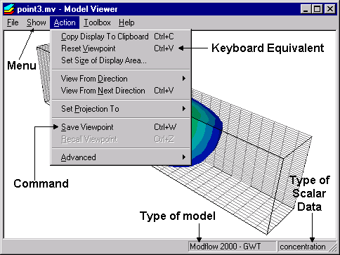

Introduction
============

**Model Viewer for Modflow 6** is a version of Model Viewer that has been customized to display the results of Modflow 6.

For brevity, "**Model Viewer for Modflow 6**" is shortened to "MvMf6" in the Help pages. 

Users who wish to display results of other models (e.g., MODFLOW-2000, MT3DMS, SUTRA, etc.) should use the standard version of Model Viewer.

"""""""""""""""""
Getting Started
"""""""""""""""""

#. To use MvMf6 (**Model Viewer for Modflow 6**), you must first run a Modflow 6 model to generate simulation results. 
#. :ref:`Create a new mvmf6 file <the_mvmf6_file>`.
#. :ref:`Load Modflow 6 data (simulation results). <loading_modflow_6_data>`
#. :ref:`Learn to zoom, rotate, and pan. <zoom>`
#. :ref:`View scalar data (heads) as a solid or a set of isosurfaces. <scalar_data>`
#. :ref:`View vector data (flows), if available. <vector_data>`
#. :ref:`View cells that contain model features such as streams and wells. <model_features>`
#. :ref:`View auxiliary graphic objects such as grid lines and bounding box. <auxiliary_graphic_objects>`
#. :ref:`Learn how to use the toolboxes for data exploration and for controlling various aspects of the display. <toolboxes>`
#. :ref:`Save the mvmf6 file. <the_mvmf6_file>`

.. _Create a new mvmf6 file: `The mvmf6 File`_

.. _user_interface:

""""""""""""""
User Interface
""""""""""""""

.. _display_area:

- Model results are shown in the **Display Area**.

- Model Viewer provides five menus (File, Show, Action, Toolbox, Help).

  * Each menu provides a drop-down list of commands.

  * Grayed out commands are inactive.

  * Certain commands can be alternatively invoked from the keyboard by holding down the Ctrl key and then pressing a letter. This keyboard equivalent, when available, is indicated to the right of the command.

- The type of model and type of scalar data are indicated at the lower right corner of the program window.

.. _the_mvmf6_file:

"""""""""""""""""
The mvmf6 File
"""""""""""""""""

- The **mvmf6 file** is used by **Model Viewer for Modflow 6** to keep track of the model data and display settings for a particular set of simulation results (model run). This file has a name that ends with **.mvmf6**.
- The **New**, **Open**, **Close**, **Save** and **Save As** commands (under the **File** menu) operate on mvmf6 files.
- The **New** command begins the process of creating a new mvmf6 file. You will be asked to load model data.
- When you **save** an mvmf6 file, **Model Viewer for Modflow 6** writes the following information to disk: the name(s) of model data files and all current display settings.

.. note::
    - The mvmf6 file does not contain the actual model data.

- The mvmf6 file must be save to the folder containing the "name" file.
- When you **open** an mvmf6 file, **Model Viewer for Modflow 6** loads the model data and sets the display according to the information saved in the mvmf6 file.
- When you **close** an mvmf6 file, **Model Viewer for Modflow 6** terminates the display of data. The program window becomes blank. The Close command is useful during repeated cycles of running a model and viewing the results. While model results are displayed in Model Viewer, the model data files cannot be over-written by another program. Closing the mvmf6 file releases the model data files so that the model can run to generate a new set of results.
- Every time you change a display setting (for example, the color bar limits), the current mvmf6 file is considered to have been changed. If you did not saved the mvmf6 file after the changes, and you try to (a) create a new mvmf6 file, or (b) close the current mvmf6 file, or (c) exit **Model Viewer for Modflow 6**, you will be prompted to save the mvmf6 file before continuing.

.. _loading_modflow_6_data:

""""""""""""""""""""""
Loading Modflow 6 Data
""""""""""""""""""""""

Model Viewer for MODFLOW 6 requires the **OC6** file be defined that sets the **HEAD FILEOUT** option to view simulated heads and optionally the **BUDGET FILEOUT** to view vectors and model features. After a Modflow 6 run has been successfully executed, the model data (simulation results) may be loaded to **Model Viewer for Modflow 6** for visualization. 

#. Click "File" and select "New." The "Modflow 6 Data Files" dialog is displayed. 
#. Specify either the Name File for a Groundwater Flow Model, or the "Grid", "Head", and "Budget" files generated by the model. 
#. Click "OK" 
